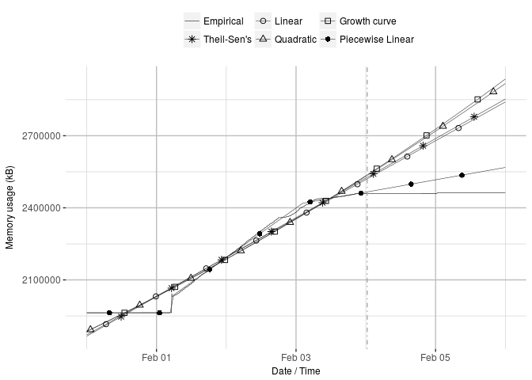

In this document, I share examples of doing software aging analysis. The analysis and plots shared in this document also appeared in our published paper [@WOSAR17]. Our analysis covers the following concepts of software aging analysis:  

1. Trend Detection - Determine if there is an increasing trend over time  
2. Trend Estimation - Model the growth trend using statistical modeling techniques  
3. Trend Prediction - Use the best-fit model to predict the future values  
  


We include the following R libraries for our analysis. You can install the missing packages using command `install.packages('package_name')`.

```r
library(Kendall)
library(boot)
library('xts')
library('zyp')
library("rjson")
library("scales")
library(ggplot2)
library(reshape2)
library(forecast)
library(plyr)
library(segmented)
library(robfilter)
library(knitr)
```

We include the following external functions.  

```r
# The following function returns the result of Mann-Kendall Test for trend detection 
# and Trend estimation using Theil-Sen's slope, both using zyp package

# output = Trend_MK_Sens(timestamp, usage) 
# where 
# timestamp = vector of timestamps
# usage = vector of usage metrics 
# output = list(trend, intercept, slope, slope_lowCI, slope_highCI) 
source('include/trend_sens.R')
```


```r
# Inclues various functions for goodness-of-fit (self explainatory)
source('include/goodness_fit.R')
```


```r
training_Set_size <- 0.67
```

## Dataset without Seasonality
As an example, we analyze the Resident Set Size (RSS) usage of PSM 'Appln2' process [@WOSAR17]. We perform trend detection using Mann-Kendall test [@Kendall-70]. Since this dataset shows a growth trend, we fit the dataset using the following modeling techiques  

1. Theil-Sen's slope [@Sen-68]
2. Linear model ($\hat{Y_t} = \beta_0 + \beta_1 t + e_t$)
3. Quadratic model ($\hat{Y_t} = \beta_0 + \beta_1 t + \beta_2 t^2 + e_t$)
4. Growth curve model ($\hat{Y_t} = \beta_0 {\beta_1}^t + e_t$)
5. Piecewise linear model (2 to 3 breakpoints)

Import the dataset

```r
import_df = read.csv('datasets/appln2.csv', header = TRUE)
timestamp = import_df$time
usage = import_df$usage
if (length(unique(timestamp)) != length(timestamp)) {
  print("WARNING: Dataset has repeated datapoints in timestamp");
}
```
Step 1: Convert timestamp to POSIX

```r
timestamp_posix <- as.POSIXct(timestamp, origin='1970-01-01', tz='EST')
analyze_df <- data.frame(time=timestamp_posix, Empirical=usage)
```

Step 2: Split into training and test

```r
training_set_index <- round(length(timestamp)*training_Set_size)
timestamp_training <- timestamp[1:training_set_index]
usage_training <- usage[1:training_set_index]
timestamp_test <- timestamp[-(1:training_set_index)]
usage_test <- usage[-(1:training_set_index)]
timestamp_train_posix <- as.POSIXct(timestamp_training, origin='1970-01-01', tz='EST')
timestamp_test_posix <- as.POSIXct(timestamp_test, origin='1970-01-01', tz='EST')
```

Step 3: Fit all models
Step 3.1: Mann-Kendall test + Theil-Sen's slope

```r
trend_analysis <- Trend_MK_Sens(timestamp_training, usage_training)

timestamp_test_diff <- difftime(timestamp_test_posix, timestamp_posix[1], units = 'days')
timestamp_train_diff <- difftime(timestamp_train_posix, timestamp_posix[1], units = 'days')
usage_pred_test <- trend_analysis$intercept + timestamp_test_diff*trend_analysis$slope
usage_pred_train <- trend_analysis$intercept + timestamp_train_diff*trend_analysis$slope

analyze_df <- cbind(analyze_df, "Theil-Sen's"=as.numeric(c(usage_pred_train,usage_pred_test)))
```

Step 3.2: Linear model

```r
lm_model_train <- lm(data = data.frame(time=timestamp_training, usage=usage_training), formula = usage ~ time)
lm_predict_test <- predict(lm_model_train, newdata = data.frame(time=timestamp_test, usage=usage_test), type = "response")
lm_predict_train <- predict(lm_model_train, newdata = data.frame(time=timestamp_training, usage=usage_training), type = "response")
analyze_df <- cbind(analyze_df, "Linear"=as.numeric(c(lm_predict_train,lm_predict_test)))
```

Step 3.3: Quadratic model

```r
lm_quad_model_train <- lm(data = data.frame(time=timestamp_training, usage=usage_training), formula = usage ~ poly(time,2))
lm_quad_predict_test <- predict(lm_quad_model_train, newdata = data.frame(time=timestamp_test, usage=usage_test), type = "response")
lm_quad_predict_train <- predict(lm_quad_model_train, newdata = data.frame(time=timestamp_training, usage=usage_training), type = "response")
analyze_df <- cbind(analyze_df, "Quadratic"=as.numeric(c(lm_quad_predict_train,lm_quad_predict_test)))
```

Step 3.4: Exp. model

```r
lm_exp_model_train <- lm(data = data.frame(time=timestamp_training, usage=usage_training), formula = log(usage) ~ time)
lm_exp_predict_test <- exp(predict(lm_exp_model_train, newdata = data.frame(time=timestamp_test, usage=usage_test), type = "response"))
lm_exp_predict_train <- exp(predict(lm_exp_model_train, newdata = data.frame(time=timestamp_training, usage=usage_training), type = "response"))
analyze_df <- cbind(analyze_df,  "Growth curve"=as.numeric(c(lm_exp_predict_train,lm_exp_predict_test)))
```

Step3.5: Segmented LM

```r
lm_segmented_model_train <- segmented(lm_model_train, seg.Z = ~time, psi=NA, control = seg.control(display = FALSE, K = 3, stop.if.error=FALSE, n.boot=0, it.max=20)) #max 2 segments for now.
```

```
## Warning: max number of iterations attained
```

```r
if(!is.null(lm_segmented_model_train$psi)) {
  lm_segmented_predict_test <- predict.segmented(lm_segmented_model_train, newdata = data.frame(time=timestamp_test, usage=usage_test))
  lm_segmented_predict_train <- predict.segmented(lm_segmented_model_train, newdata = data.frame(time=timestamp_training, usage=usage_training))
  analyze_df <- cbind(analyze_df, "Piecewise Linear"=as.numeric(c(lm_segmented_predict_train,lm_segmented_predict_test)))
  accuracy_SLM <- accuracy(analyze_df[,7], analyze_df[,2], test = (training_set_index:length(analyze_df$time)))
} else {
  accuracy_SLM <- c(NA,NA,NA,NA,NA,NA)
}
```

Finally, plot our results. The following figure is the same as Fig. 2 in [@WOSAR17]

```r
melt_df <- melt(analyze_df, id = "time")
type <- 'Memory usage (kB)'
melt_df$linethick <- rep(c(0.1, 0.1, 0.1, 0.1, 0.1, 0.1), each=dim(analyze_df)[1])
shape_palette <- c(32,8,1,2,0,16)
palet <- c("#000000", "#333333", "#333333", "#333333", "#333333", "#333333", "#333333", "#333333")
ggplot(melt_df, aes(time, value)) + geom_line(size=0.2, aes(color=variable)) + geom_point(size=2, data=melt_df[seq(1,nrow(melt_df),200),], aes(time, value, shape=variable)) + scale_shape_manual(name = "", values=shape_palette) + scale_size(guide=FALSE) + scale_colour_manual(values=palet, name = "")   + scale_fill_grey() + theme(panel.grid.major = element_line(colour = 'grey'), panel.grid.minor = element_line(colour = 'light grey'), panel.background = element_rect(fill = 'white'), axis.title.x = element_text(size=9), axis.title.y = element_text(size=9), legend.text = element_text(size=9), axis.text.x = element_text(size=9), axis.text.y = element_text(size=9), legend.position="top")  + xlab("Date / Time") + ylab(type) + geom_vline(xintercept = as.numeric(as.POSIXct(timestamp[training_set_index], origin='1970-01-01', tz='UTC')), linetype='dotdash', colour='dark grey')
```

<!-- -->

To estimate the goodness-of-fit,

```r
accuracy_Sen <- accuracy(analyze_df[,3], analyze_df[,2], test = (training_set_index:length(analyze_df$time)))
accuracy_LM <- accuracy(analyze_df[,4], analyze_df[,2], test = (training_set_index:length(analyze_df$time)))
accuracy_Quad <- accuracy(analyze_df[,5], analyze_df[,2], test = (training_set_index:length(analyze_df$time)))
accuracy_Exp <- accuracy(analyze_df[,6], analyze_df[,2], test = (training_set_index:length(analyze_df$time)))

gof_df = rbind(accuracy_Sen, accuracy_LM, accuracy_Quad, accuracy_Exp, accuracy_SLM)
rownames(gof_df) = c("Theil-Sen", "Linear", "Quadratic", "Growth", "Piecewise linear (2 breaks)")
kable(gof_df)
```

                                       ME        RMSE         MAE          MPE        MAPE
----------------------------  -----------  ----------  ----------  -----------  ----------
Theil-Sen                      -227797.70   246277.40   227797.70    -9.255288    9.255288
Linear                         -218733.11   237274.59   218733.11    -8.886966    8.886966
Quadratic                      -260625.92   282917.65   260625.92   -10.589033   10.589033
Growth                         -269637.26   293073.92   269637.26   -10.955142   10.955142
Piecewise linear (2 breaks)     -55866.28    62760.48    55866.28    -2.269730    2.269730

Thus Piecewise linear is the best-fit model. 

## Dataset with Seasonality


### Cross-validation


# References
