Software aging analysis
================
Harish Sukhwani (h (dot) sukhwani AT gmail (dot) com)
2018-09-13

In this document, I share examples of doing software aging analysis using R. Our analysis covers the following concepts of software aging analysis:

1.  Trend Detection - Determine if there is an increasing trend over time
2.  Trend Estimation - Model the growth trend using statistical modeling techniques
3.  Trend Prediction - Use the best-fit model to predict the future values

The concepts demonstrated here are mature in the software aging community (see (Grottke, Matias, and Trivedi 2008), (Cotroneo et al. 2014)). While doing my research in 2016-2017, surprisingly, I could not find relevant sample code or examples for reference. I thought of sharing the code and analysis of representative examples from our published paper (Sukhwani et al. 2017).

We include the following R libraries for our analysis. You can install the missing packages using command `install.packages('package_name')`.

``` r
library(fpp)
library(Kendall)
library(boot)
library('xts')
library('zyp')
library("rjson")
library("scales")
library(ggplot2)
library(reshape2)
library(forecast)
library(plyr)
library(segmented)
library(robfilter)
library(knitr)
```

We include the following external functions.

``` r
# The following function returns the result of Mann-Kendall Test for trend detection 
# and Trend estimation using Theil-Sen's slope, both using zyp package

# output = Trend_MK_Sens(timestamp, usage) 
# where 
# timestamp = vector of timestamps
# usage = vector of usage metrics 
# output = list(trend, intercept, slope, slope_lowCI, slope_highCI) 
source('include/trend_sens.R')
```

``` r
# Inclues various functions for goodness-of-fit (self explainatory)
source('include/goodness_fit.R')
```

``` r
training_Set_size <- 0.67
```

Dataset without Seasonality
===========================

As an example, we analyze the Resident Set Size (RSS) usage of PSM 'Appln2' process (Sukhwani et al. 2017). We perform trend detection using Mann-Kendall test (Kendall 1970). Since this dataset shows a growth trend, we fit the dataset using the following modeling techiques

1.  Theil-Sen's slope (Sen 1968)
2.  Linear model ($\\hat{Y\_t} = \\beta\_0 + \\beta\_1 t + e\_t$)
3.  Quadratic model ($\\hat{Y\_t} = \\beta\_0 + \\beta\_1 t + \\beta\_2 t^2 + e\_t$)
4.  Growth curve model ($\\hat{Y\_t} = \\beta\_0 {\\beta\_1}^t + e\_t$)
5.  Piecewise linear model (2 to 3 breakpoints)

Import the dataset

``` r
import_df = read.csv('datasets/appln2.csv', header = TRUE)
timestamp = import_df$time
usage = import_df$usage
if (length(unique(timestamp)) != length(timestamp)) {
  print("WARNING: Dataset has repeated datapoints in timestamp");
}
```

Step 1: Convert timestamp to POSIX

``` r
timestamp_posix <- as.POSIXct(timestamp, origin='1970-01-01', tz='EST')
analyze_df <- data.frame(time=timestamp_posix, Empirical=usage)
```

Step 2: Split into training and test

``` r
training_set_index <- round(length(timestamp)*training_Set_size)
timestamp_training <- timestamp[1:training_set_index]
usage_training <- usage[1:training_set_index]
timestamp_test <- timestamp[-(1:training_set_index)]
usage_test <- usage[-(1:training_set_index)]
timestamp_train_posix <- as.POSIXct(timestamp_training, origin='1970-01-01', tz='EST')
timestamp_test_posix <- as.POSIXct(timestamp_test, origin='1970-01-01', tz='EST')
```

Step 3: Fit all models Step 3.1: Mann-Kendall test + Theil-Sen's slope

``` r
trend_analysis <- Trend_MK_Sens(timestamp_training, usage_training)

timestamp_test_diff <- difftime(timestamp_test_posix, timestamp_posix[1], units = 'days')
timestamp_train_diff <- difftime(timestamp_train_posix, timestamp_posix[1], units = 'days')
usage_pred_test <- trend_analysis$intercept + timestamp_test_diff*trend_analysis$slope
usage_pred_train <- trend_analysis$intercept + timestamp_train_diff*trend_analysis$slope

analyze_df <- cbind(analyze_df, "Theil-Sen's"=as.numeric(c(usage_pred_train,usage_pred_test)))
```

Step 3.2: Linear model

``` r
lm_model_train <- lm(data = data.frame(time=timestamp_training, usage=usage_training), formula = usage ~ time)
lm_predict_test <- predict(lm_model_train, newdata = data.frame(time=timestamp_test, usage=usage_test), type = "response")
lm_predict_train <- predict(lm_model_train, newdata = data.frame(time=timestamp_training, usage=usage_training), type = "response")
analyze_df <- cbind(analyze_df, "Linear"=as.numeric(c(lm_predict_train,lm_predict_test)))
```

Step 3.3: Quadratic model

``` r
lm_quad_model_train <- lm(data = data.frame(time=timestamp_training, usage=usage_training), formula = usage ~ poly(time,2))
lm_quad_predict_test <- predict(lm_quad_model_train, newdata = data.frame(time=timestamp_test, usage=usage_test), type = "response")
lm_quad_predict_train <- predict(lm_quad_model_train, newdata = data.frame(time=timestamp_training, usage=usage_training), type = "response")
analyze_df <- cbind(analyze_df, "Quadratic"=as.numeric(c(lm_quad_predict_train,lm_quad_predict_test)))
```

Step 3.4: Exp. model

``` r
lm_exp_model_train <- lm(data = data.frame(time=timestamp_training, usage=usage_training), formula = log(usage) ~ time)
lm_exp_predict_test <- exp(predict(lm_exp_model_train, newdata = data.frame(time=timestamp_test, usage=usage_test), type = "response"))
lm_exp_predict_train <- exp(predict(lm_exp_model_train, newdata = data.frame(time=timestamp_training, usage=usage_training), type = "response"))
analyze_df <- cbind(analyze_df,  "Growth curve"=as.numeric(c(lm_exp_predict_train,lm_exp_predict_test)))
```

Step3.5: Segmented LM

``` r
lm_segmented_model_train <- segmented(lm_model_train, seg.Z = ~time, psi=NA, control = seg.control(display = FALSE, K = 3, stop.if.error=FALSE, n.boot=0, it.max=20)) #max 2 segments for now.
```

    ## Warning: max number of iterations attained

``` r
if(!is.null(lm_segmented_model_train$psi)) {
  lm_segmented_predict_test <- predict.segmented(lm_segmented_model_train, newdata = data.frame(time=timestamp_test, usage=usage_test))
  lm_segmented_predict_train <- predict.segmented(lm_segmented_model_train, newdata = data.frame(time=timestamp_training, usage=usage_training))
  analyze_df <- cbind(analyze_df, "Piecewise Linear"=as.numeric(c(lm_segmented_predict_train,lm_segmented_predict_test)))
  accuracy_SLM <- accuracy(analyze_df[,7], analyze_df[,2], test = (training_set_index:length(analyze_df$time)))
} else {
  accuracy_SLM <- c(NA,NA,NA,NA,NA,NA)
}
```

Finally, plot our results. The following figure is the same as Fig. 2 in (Sukhwani et al. 2017)

``` r
melt_df <- melt(analyze_df, id = "time")
type <- 'Memory usage (kB)'
melt_df$linethick <- rep(c(0.1, 0.1, 0.1, 0.1, 0.1, 0.1), each=dim(analyze_df)[1])
shape_palette <- c(32,8,1,2,0,16)
palet <- c("#000000", "#333333", "#333333", "#333333", "#333333", "#333333", "#333333", "#333333")
ggplot(melt_df, aes(time, value)) + geom_line(size=0.2, aes(color=variable)) + geom_point(size=2, data=melt_df[seq(1,nrow(melt_df),200),], aes(time, value, shape=variable)) + scale_shape_manual(name = "", values=shape_palette) + scale_size(guide=FALSE) + scale_colour_manual(values=palet, name = "")   + scale_fill_grey() + theme(panel.grid.major = element_line(colour = 'grey'), panel.grid.minor = element_line(colour = 'light grey'), panel.background = element_rect(fill = 'white'), axis.title.x = element_text(size=9), axis.title.y = element_text(size=9), legend.text = element_text(size=9), axis.text.x = element_text(size=9), axis.text.y = element_text(size=9), legend.position="top")  + xlab("Date / Time") + ylab(type) + geom_vline(xintercept = as.numeric(as.POSIXct(timestamp[training_set_index], origin='1970-01-01', tz='UTC')), linetype='dotdash', colour='dark grey')
```


To estimate the goodness-of-fit,

``` r
accuracy_Sen <- accuracy(analyze_df[,3], analyze_df[,2], test = (training_set_index:length(analyze_df$time)))
accuracy_LM <- accuracy(analyze_df[,4], analyze_df[,2], test = (training_set_index:length(analyze_df$time)))
accuracy_Quad <- accuracy(analyze_df[,5], analyze_df[,2], test = (training_set_index:length(analyze_df$time)))
accuracy_Exp <- accuracy(analyze_df[,6], analyze_df[,2], test = (training_set_index:length(analyze_df$time)))

gof_df = rbind(accuracy_Sen, accuracy_LM, accuracy_Quad, accuracy_Exp, accuracy_SLM)
rownames(gof_df) = c("Theil-Sen", "Linear", "Quadratic", "Growth", "Piecewise linear (2 breaks)")
kable(gof_df)
```

|                             |          ME|       RMSE|        MAE|         MPE|       MAPE|
|-----------------------------|-----------:|----------:|----------:|-----------:|----------:|
| Theil-Sen                   |  -227797.70|  246277.40|  227797.70|   -9.255288|   9.255288|
| Linear                      |  -218733.11|  237274.59|  218733.11|   -8.886966|   8.886966|
| Quadratic                   |  -260625.92|  282917.65|  260625.92|  -10.589033|  10.589033|
| Growth                      |  -269637.26|  293073.92|  269637.26|  -10.955142|  10.955142|
| Piecewise linear (2 breaks) |   -55866.28|   62760.48|   55866.28|   -2.269730|   2.269730|

Thus Piecewise linear is the best-fit model.

Comments about goodness-of-fit metrics MSE - Scale dependent. MAPE - Scale independent, makes sense if *y*<sub>*t*</sub> &gt; &gt;0 and y has a natural zero MASE - (proposed by Dr. Hyndman, read his paper (Rob J. Hyndman and Koehler 2006))

Dataset with Seasonality
========================

We analyze the disk usage of '/var/log' partition. We follow the analysis procedure described by (Rob J Hyndman and Athanasopoulos 2013).

Import the dataset

``` r
import_df = read.csv('datasets/varlog.csv', header = TRUE)
timestamp_raw = import_df$time
usage_raw = import_df$usage
if (length(unique(timestamp_raw)) != length(timestamp_raw)) {
  print("WARNING: Dataset has repeated datapoints in timestamp_raw");
}
```

Plot the dataset

``` r
timestamp_posix <- as.POSIXct(timestamp_raw, origin='1970-01-01', tz='EST')
analyze_df <- data.frame(time=timestamp_posix, Empirical=usage_raw)
ggplot(melt(analyze_df, id = "time"), aes(time, value, color=variable)) + geom_line(size=0.5) + scale_fill_grey() + theme(panel.grid.major = element_line(colour = 'grey'), panel.grid.minor = element_line(colour = 'light grey'), panel.background = element_rect(fill = 'white')) + ggtitle("Analysis for disk usage (/var/log)") + xlab("Date/Time") + ylab('Usage (%)') + scale_colour_manual(values=palet) + labs(colour = "") 
```

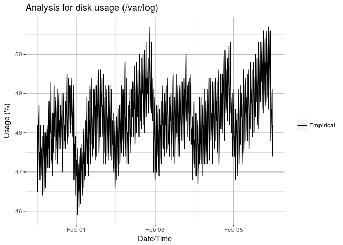

From the plots, we observe two seasonal patterns, one daily and one hourly. This partition's disk uage increases during the day as log files are appended. At the end of the day, a certain portion of the disk partition is backed up, thus reducing the disk usage by a few percentage. However the disk usage is not back to the original value as the previous day, and hence the aging. We are not sure what causes the hourly seasonal pattern in the data.

Let us consider two kind of datasets for our analysis. The first one is the above raw dataset that shows both hourly and daily seasonal pattern. The second one is the dataset with data averaged every hour, thus smoothening the hourly seasonal pattern. For each analytical technique, we use both the datasets and place the results for comparison sake. We skip certain analysis for certain datasets.

Import the hourly averaged dataset

``` r
import_df = read.csv('datasets/varlog_hr.csv', header = TRUE)
timestamp_hr = import_df$time
usage_hr = import_df$usage
if (length(unique(timestamp_hr)) != length(timestamp_hr)) {
  print("WARNING: Dataset has repeated datapoints in timestamp");
}
```

Step 1: Prepare the Time-series (TS) datasets

``` r
training_set_index <- round(length(timestamp_raw)*training_Set_size)
timestamp_raw_train <- timestamp_raw[1:training_set_index]
usage_raw_train <- usage_raw[1:training_set_index]
timestamp_raw_test <- timestamp_raw[-(1:training_set_index)]
usage_raw_test <- usage_raw[-(1:training_set_index)]

timestamp_raw_posix <-  as.POSIXct(timestamp_raw, origin='1970-01-01', tz='EST')
timestamp_raw_train_posix <- as.POSIXct(timestamp_raw_train, origin='1970-01-01', tz='EST')
timestamp_raw_test_posix <- as.POSIXct(timestamp_raw_test, origin='1970-01-01', tz='EST')

usage_train_ts <- ts(usage_raw_train, frequency = 12)
usage_train_xts <- xts(usage_raw_train, order.by = timestamp_raw_train_posix)

usage_test_ts <- ts(usage_raw_test, frequency = 12)
usage_test_xts <- xts(usage_raw_test, order.by = timestamp_raw_test_posix)
test_length <- length(usage_raw_test)
```

``` r
training_hr_set_index <- round(length(timestamp_hr) * training_Set_size)
timestamp_hr_posix = as.POSIXct(timestamp_hr, origin="1970-01-01", tz="EST")
timestamp_hr_train_posix <- timestamp_hr_posix[1:training_hr_set_index]
timestamp_hr_test_posix <- timestamp_hr_posix[-c(1:training_hr_set_index)]

usage_hr_train <- usage_hr[1:training_hr_set_index]
usage_hr_test <- usage_hr[-c(1:training_hr_set_index)]

usage_hr_train_ts <- ts(usage_hr_train, frequency = 24)
usage_hr_train_xts <- xts(usage_hr_train, order.by = timestamp_hr_train_posix)
usage_hr_test_ts <- ts(usage_hr_test, frequency = 24)
usage_hr_test_xts <- xts(usage_hr_test, order.by = timestamp_hr_test_posix)
test_hr_length <- length(usage_hr_test)
```

Step 2: Check the Autocorrelation (ACF) plot

``` r
acf(usage_train_xts, main="")
```

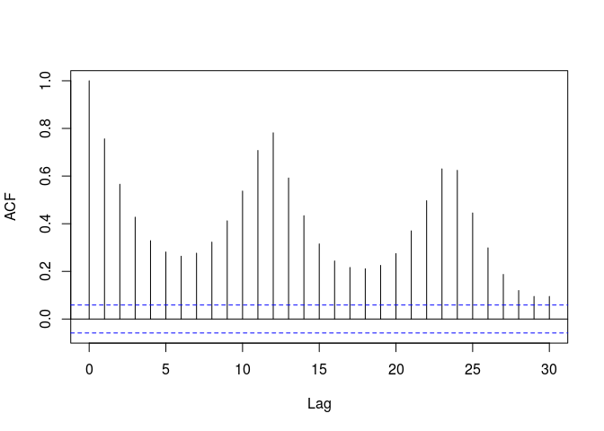

``` r
tsdisplay(usage_hr_train_xts)
```

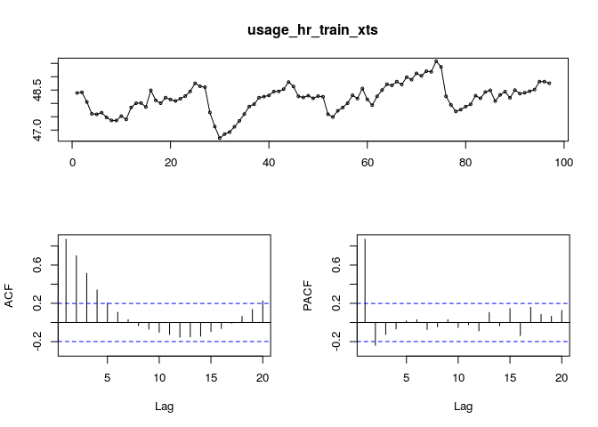

From the ACF plot, we observe an hourly seasonal pattern (at lag 12, 24 and so on), but we cannot explain it. We remove the hourly seasonal pattern by using hourly approximated data; thus our dataset has a period of 24 (corresponding to 24 samples per day).

For the raw dataset, we decompose and remove the seasonal pattern

``` r
usage_train_ts_decomposed <- decompose(usage_train_ts)
usage_train_decom_ts <- usage_train_ts - usage_train_ts_decomposed$seasonal
usage_train_ts <- usage_train_decom_ts
```

We applied the following models to our datasets (in a similar sequence as that in (Rob J Hyndman and Athanasopoulos 2013)). Please ignore any warnings in the plots below. Apologies for the same, can't figure out the packages in Rmd.

Random walk forecasting
-----------------------

``` r
fc <- rwf(usage_train_ts)
```

For this model, we also demonstrate the procedure of evaluating a good model. This procedure can be applied to the following models as well, but skipped for brevity.

``` r
res <- residuals(fc)
res <- res[2:length(res)] #first value is usually NA
plot(density(res)) #Should be whitenoise => should have mean zero, constant variance, normally distributed. Should be uncorrelated as well
```

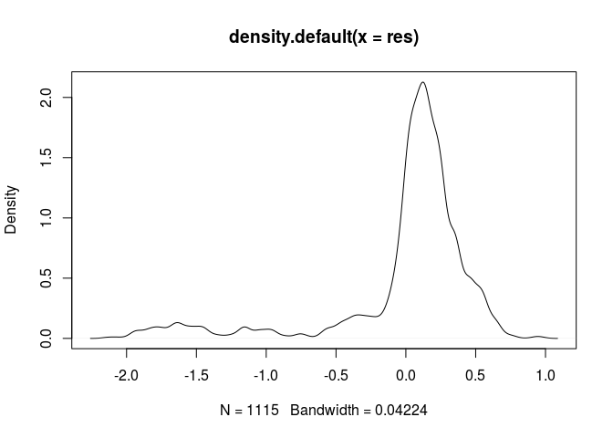

``` r
acf(res) #95% values should be within the +-1.96/\sqrt{T}, then it is whitenoise. 
```

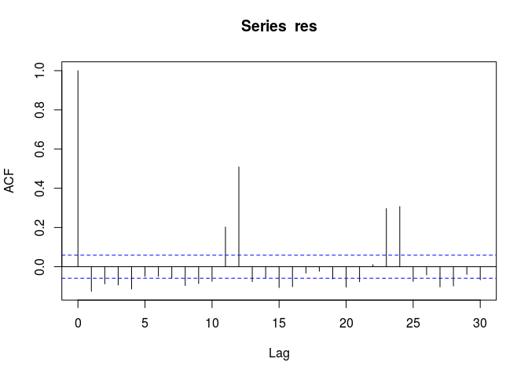

``` r
#Statistical test to check if the residuals are white-noise. 
Box.test(res, lag=12, fitdf=0) #change fitdf to no. of params (k), lag = h. Q* has a chi-2 distn with h-k degrees of f. 
```

    ## 
    ##  Box-Pierce test
    ## 
    ## data:  res
    ## X-squared = 418.41, df = 12, p-value < 2.2e-16

``` r
#when applied to raw data, k = 0. If p-value > 0.05, then it ''could'' be white-noise, else it is not. 
Box.test(res, lag=12, fitdf=0, type = "Ljung")
```

    ## 
    ##  Box-Ljung test
    ## 
    ## data:  res
    ## X-squared = 423.12, df = 12, p-value < 2.2e-16

``` r
fc <- rwf(usage_hr_train_ts) # or any such model
res <- residuals(fc)
res <- res[2:length(res)] #first value is usually NA
plot(density(res)) #Should be whitenoise => should have mean zero, constant variance, normally distributed. Should be uncorrelated as well
```

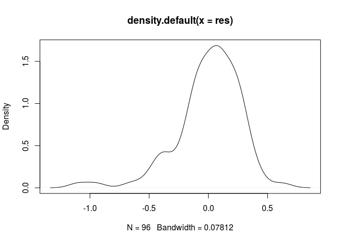

``` r
acf(res) #95% values should be within the +-1.96/\sqrt{T}, then it is whitenoise. 
```

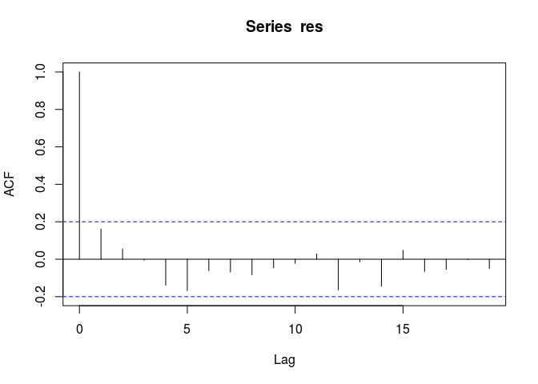

``` r
#Statistical test to check if the residuals are white-noise. 
Box.test(res, lag=12, fitdf=0) #change fitdf to no. of params (k), lag = h. Q* has a chi-2 distn with h-k degrees of f. 
```

    ## 
    ##  Box-Pierce test
    ## 
    ## data:  res
    ## X-squared = 11.75, df = 12, p-value = 0.466

``` r
#when applied to raw data, k = 0. If p-value > 0.05, then it ''could'' be white-noise, else it is not. 
Box.test(res, lag=12, fitdf=0, type = "Ljung")
```

    ## 
    ##  Box-Ljung test
    ## 
    ## data:  res
    ## X-squared = 12.8, df = 12, p-value = 0.3838

Simple exp. smoothing (level only)
----------------------------------

``` r
ses_fit <- ses(usage_train_ts, h = test_length) #12 hours
accuracy_SES_raw <- accuracy(ses_fit$mean, usage_raw_test)
plot(ses_fit, plot.conf=TRUE)
```

    ## Warning in plot.window(xlim, ylim, log, ...): "plot.conf" is not a
    ## graphical parameter

    ## Warning in title(main = main, xlab = xlab, ylab = ylab, ...): "plot.conf"
    ## is not a graphical parameter

    ## Warning in axis(1, ...): "plot.conf" is not a graphical parameter

    ## Warning in axis(2, ...): "plot.conf" is not a graphical parameter

    ## Warning in box(...): "plot.conf" is not a graphical parameter

``` r
lines(fitted(ses_fit), col="red")
```

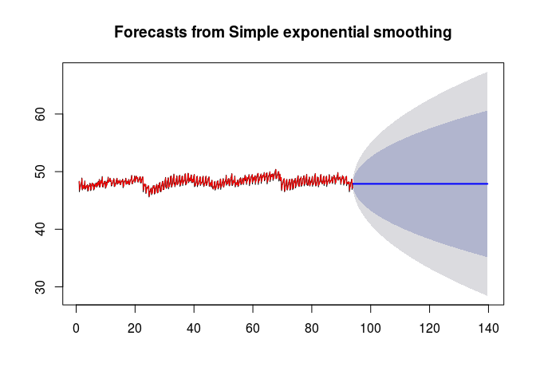

``` r
ses_fit <- ses(usage_hr_train_ts, h = test_hr_length)
accuracy_SES_hr <- accuracy(ses_fit$mean, usage_hr_test)
plot(ses_fit, plot.conf=TRUE)
```

    ## Warning in plot.window(xlim, ylim, log, ...): "plot.conf" is not a
    ## graphical parameter

    ## Warning in title(main = main, xlab = xlab, ylab = ylab, ...): "plot.conf"
    ## is not a graphical parameter

    ## Warning in axis(1, ...): "plot.conf" is not a graphical parameter

    ## Warning in axis(2, ...): "plot.conf" is not a graphical parameter

    ## Warning in box(...): "plot.conf" is not a graphical parameter

``` r
lines(fitted(ses_fit), col="red")
```

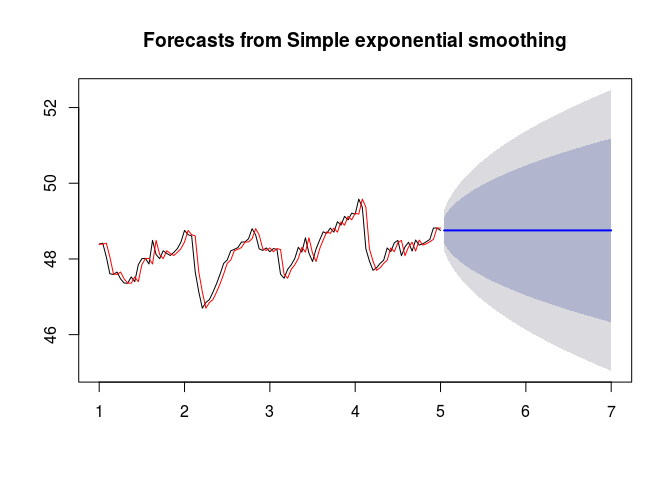

Holt (SES + linear trend)
-------------------------

``` r
holt_fit <- holt(usage_train_ts, h = test_length)
accuracy_Holt_raw <- accuracy(holt_fit$mean, usage_raw_test)
plot(holt_fit, plot.conf=TRUE)
```

    ## Warning in plot.window(xlim, ylim, log, ...): "plot.conf" is not a
    ## graphical parameter

    ## Warning in title(main = main, xlab = xlab, ylab = ylab, ...): "plot.conf"
    ## is not a graphical parameter

    ## Warning in axis(1, ...): "plot.conf" is not a graphical parameter

    ## Warning in axis(2, ...): "plot.conf" is not a graphical parameter

    ## Warning in box(...): "plot.conf" is not a graphical parameter

``` r
lines(fitted(holt_fit), col="red")
```

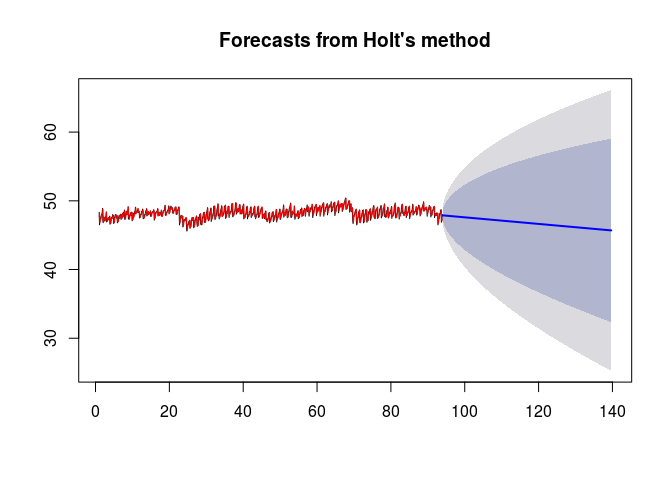

``` r
holt_fit <- holt(usage_hr_train_ts, h = test_hr_length)
accuracy_Holt_hr <- accuracy(holt_fit$mean, usage_hr_test)
plot(holt_fit, plot.conf=TRUE)
```

    ## Warning in plot.window(xlim, ylim, log, ...): "plot.conf" is not a
    ## graphical parameter

    ## Warning in title(main = main, xlab = xlab, ylab = ylab, ...): "plot.conf"
    ## is not a graphical parameter

    ## Warning in axis(1, ...): "plot.conf" is not a graphical parameter

    ## Warning in axis(2, ...): "plot.conf" is not a graphical parameter

    ## Warning in box(...): "plot.conf" is not a graphical parameter

``` r
lines(fitted(holt_fit), col="red")
```

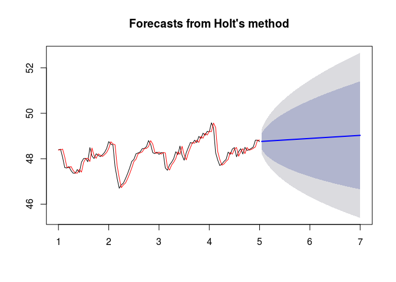

Holt (SES + exponential trend)
------------------------------

``` r
#holt_exp_fit <- holt(usage_train_ts, h = test_length, exponential = TRUE)
#plot(holt_exp_fit, plot.conf=TRUE)
#lines(fitted(holt_exp_fit), col="red")
#accuracy_Holt_Exp_raw <- accuracy(holt_exp_fit$mean, usage_raw_test)
```

``` r
#holt_exp_fit <- holt(usage_hr_train_ts, h = test_hr_length, exponential = TRUE)
#plot(holt_exp_fit, plot.conf=TRUE)
#lines(fitted(holt_exp_fit), col="red")
#accuracy_Holt_Exp_hr <- accuracy(holt_exp_fit$mean, usage_hr_test)
```

Holt (SES + linear + damped trend)
----------------------------------

Damped is useful for long horizon forecast

``` r
holt_damp_fit <- holt(usage_train_ts, h = test_length, damped = TRUE)
accuracy_Holt_damp_raw <- accuracy(holt_damp_fit$mean, usage_raw_test)
plot(holt_damp_fit, plot.conf=TRUE)
```

    ## Warning in plot.window(xlim, ylim, log, ...): "plot.conf" is not a
    ## graphical parameter

    ## Warning in title(main = main, xlab = xlab, ylab = ylab, ...): "plot.conf"
    ## is not a graphical parameter

    ## Warning in axis(1, ...): "plot.conf" is not a graphical parameter

    ## Warning in axis(2, ...): "plot.conf" is not a graphical parameter

    ## Warning in box(...): "plot.conf" is not a graphical parameter

``` r
lines(fitted(holt_damp_fit), col="red")
```

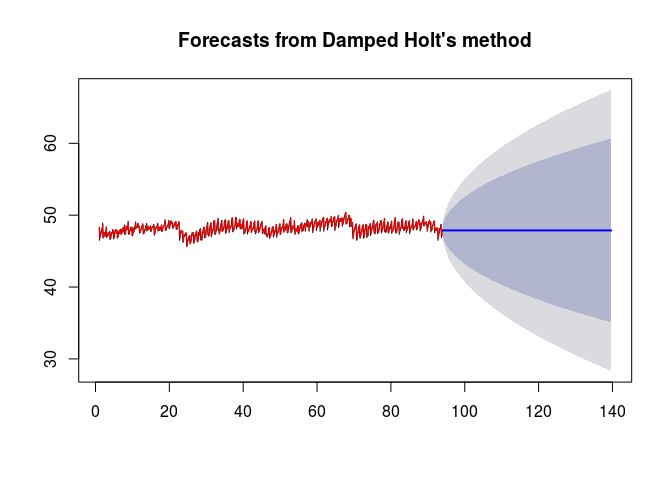

``` r
holt_damp_fit <- holt(usage_hr_train_ts, h = test_hr_length, damped = TRUE)
accuracy_Holt_damp_hr <- accuracy(holt_damp_fit$mean, usage_hr_test)
plot(holt_damp_fit, plot.conf=TRUE)
```

    ## Warning in plot.window(xlim, ylim, log, ...): "plot.conf" is not a
    ## graphical parameter

    ## Warning in title(main = main, xlab = xlab, ylab = ylab, ...): "plot.conf"
    ## is not a graphical parameter

    ## Warning in axis(1, ...): "plot.conf" is not a graphical parameter

    ## Warning in axis(2, ...): "plot.conf" is not a graphical parameter

    ## Warning in box(...): "plot.conf" is not a graphical parameter

``` r
lines(fitted(holt_damp_fit), col="red")
```

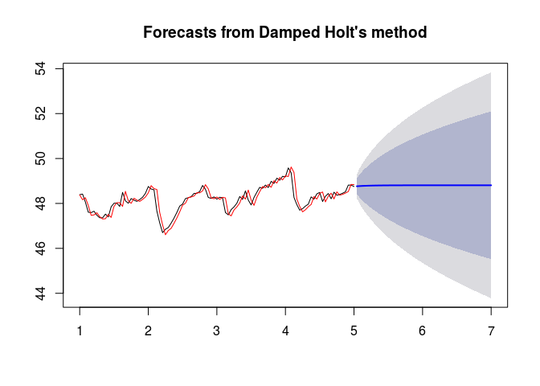

Holt-Winters (Holt + seasonality)
---------------------------------

``` r
hw_fit <- hw(usage_train_ts, h = test_length) #Predict for 12hrs
accuracy_HW_raw <- accuracy(hw_fit$mean, usage_raw_test)
plot(hw_fit, plot.conf=TRUE, xlab="Date / Time", ylab="/var/log (%)", main="")
```

    ## Warning in plot.window(xlim, ylim, log, ...): "plot.conf" is not a
    ## graphical parameter

    ## Warning in title(main = main, xlab = xlab, ylab = ylab, ...): "plot.conf"
    ## is not a graphical parameter

    ## Warning in axis(1, ...): "plot.conf" is not a graphical parameter

    ## Warning in axis(2, ...): "plot.conf" is not a graphical parameter

    ## Warning in box(...): "plot.conf" is not a graphical parameter

``` r
lines(fitted(hw_fit), col="red")
```

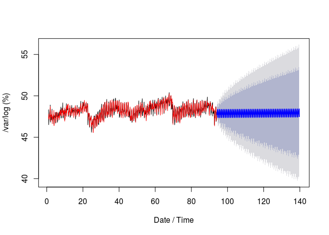

``` r
#title(main="Forecasts from Holt-Winters' additive method",  cex.main=1)
```

``` r
hw_fit <- hw(usage_hr_train_ts, h = test_hr_length, level=c(50,95)) #Predict for 12hrs
accuracy_HW_hr <- accuracy(hw_fit$mean, usage_hr_test)
plot(hw_fit, plot.conf=TRUE, xlab="Date / Time", ylab="/var/log (%)", main="")
```

    ## Warning in plot.window(xlim, ylim, log, ...): "plot.conf" is not a
    ## graphical parameter

    ## Warning in title(main = main, xlab = xlab, ylab = ylab, ...): "plot.conf"
    ## is not a graphical parameter

    ## Warning in axis(1, ...): "plot.conf" is not a graphical parameter

    ## Warning in axis(2, ...): "plot.conf" is not a graphical parameter

    ## Warning in box(...): "plot.conf" is not a graphical parameter

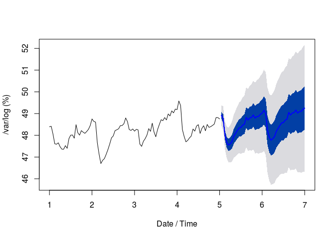

``` r
lines(fitted(hw_fit), col="red")
```

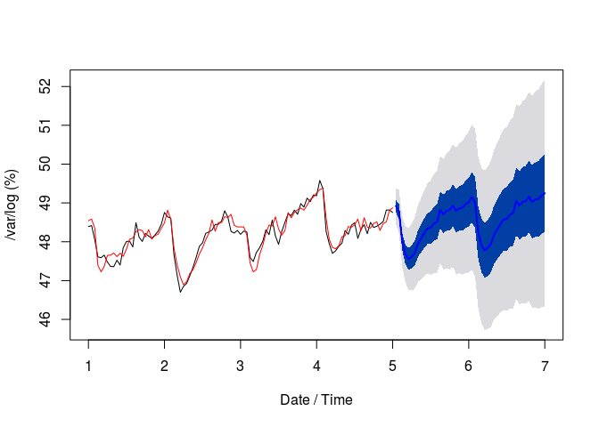

The above plot appears as Fig.5 in (Sukhwani et al. 2017).

Holt-Winters (Holt + multiplicative seasonality)
------------------------------------------------

``` r
hw_mult_fit <- hw(usage_train_ts, seasonal="mult", h = test_length) #Predict for 12hrs
accuracy_HW_mult_raw <- accuracy(hw_mult_fit$mean, usage_raw_test)
plot(hw_mult_fit, plot.conf=TRUE)
```

    ## Warning in plot.window(xlim, ylim, log, ...): "plot.conf" is not a
    ## graphical parameter

    ## Warning in title(main = main, xlab = xlab, ylab = ylab, ...): "plot.conf"
    ## is not a graphical parameter

    ## Warning in axis(1, ...): "plot.conf" is not a graphical parameter

    ## Warning in axis(2, ...): "plot.conf" is not a graphical parameter

    ## Warning in box(...): "plot.conf" is not a graphical parameter

``` r
lines(fitted(hw_mult_fit), col="red")
```

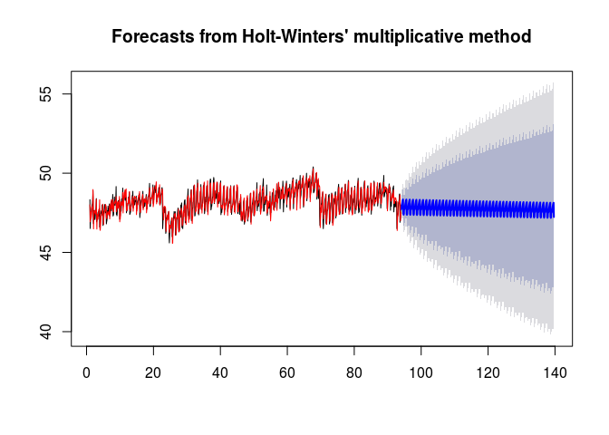

``` r
hw_mult_fit <- hw(usage_hr_train_ts, seasonal="mult", h = test_hr_length) #Predict for 12hrs
accuracy_HW_mult_hr <- accuracy(hw_mult_fit$mean, usage_hr_test)
plot(hw_mult_fit, plot.conf=TRUE)
```

    ## Warning in plot.window(xlim, ylim, log, ...): "plot.conf" is not a
    ## graphical parameter

    ## Warning in title(main = main, xlab = xlab, ylab = ylab, ...): "plot.conf"
    ## is not a graphical parameter

    ## Warning in axis(1, ...): "plot.conf" is not a graphical parameter

    ## Warning in axis(2, ...): "plot.conf" is not a graphical parameter

    ## Warning in box(...): "plot.conf" is not a graphical parameter

``` r
lines(fitted(hw_mult_fit), col="red")
```

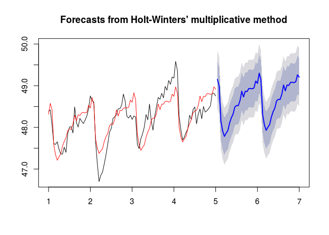

Holt-Winters (Holt + multiplicative seasonality + damped)
---------------------------------------------------------

``` r
hw_mult_damped_fit <- hw(usage_train_ts, seasonal="mult", damped=TRUE, h = test_length) #Predict for 12hrs
accuracy_Holt_mult_damp_raw <- accuracy(hw_mult_damped_fit$mean, usage_raw_test)
plot(hw_mult_damped_fit, plot.conf=TRUE)
```

    ## Warning in plot.window(xlim, ylim, log, ...): "plot.conf" is not a
    ## graphical parameter

    ## Warning in title(main = main, xlab = xlab, ylab = ylab, ...): "plot.conf"
    ## is not a graphical parameter

    ## Warning in axis(1, ...): "plot.conf" is not a graphical parameter

    ## Warning in axis(2, ...): "plot.conf" is not a graphical parameter

    ## Warning in box(...): "plot.conf" is not a graphical parameter

``` r
lines(fitted(hw_mult_damped_fit), col="red")
```

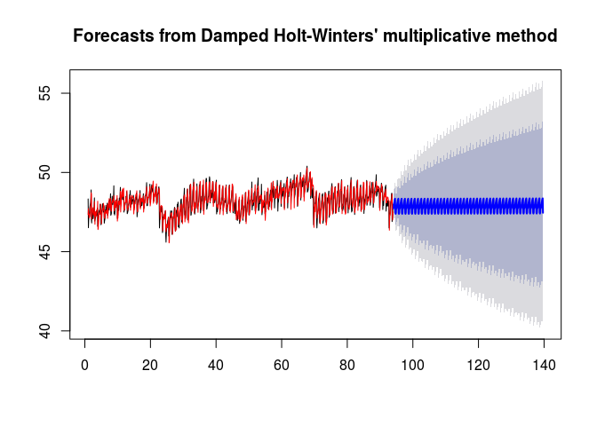

``` r
hw_mult_damped_fit <- hw(usage_hr_train_ts, seasonal="mult", damped=TRUE, h = test_hr_length) #Predict for 12hrs
accuracy_Holt_mult_damp_hr <- accuracy(hw_mult_damped_fit$mean, usage_hr_test)
plot(hw_mult_damped_fit, plot.conf=TRUE)
```

    ## Warning in plot.window(xlim, ylim, log, ...): "plot.conf" is not a
    ## graphical parameter

    ## Warning in title(main = main, xlab = xlab, ylab = ylab, ...): "plot.conf"
    ## is not a graphical parameter

    ## Warning in axis(1, ...): "plot.conf" is not a graphical parameter

    ## Warning in axis(2, ...): "plot.conf" is not a graphical parameter

    ## Warning in box(...): "plot.conf" is not a graphical parameter

``` r
lines(fitted(hw_mult_damped_fit), col="red")
```

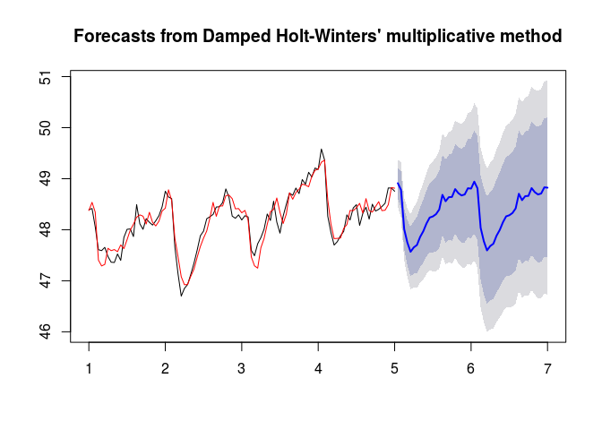

ARIMA
-----

``` r
fit_arima <- auto.arima(usage_hr_train_ts, max.P = 0, max.Q = 0, D = 0)
fit_arima_forecast <- forecast(fit_arima, h =test_hr_length)
accuracy_ARIMA_hr <- accuracy(fit_arima_forecast$mean, usage_hr_test)
plot(fit_arima_forecast)
```


ARIMA (by hand)
---------------

``` r
fit_arima_hand <- arima(x = usage_hr_train_ts, order = c(4,1,0))
fit_arima_forecast_hand <- forecast(fit_arima_hand, h =test_hr_length)
accuracy_ARIMA_hr_hand <- accuracy(fit_arima_forecast_hand$mean, usage_hr_test)
plot(fit_arima_forecast_hand)
```

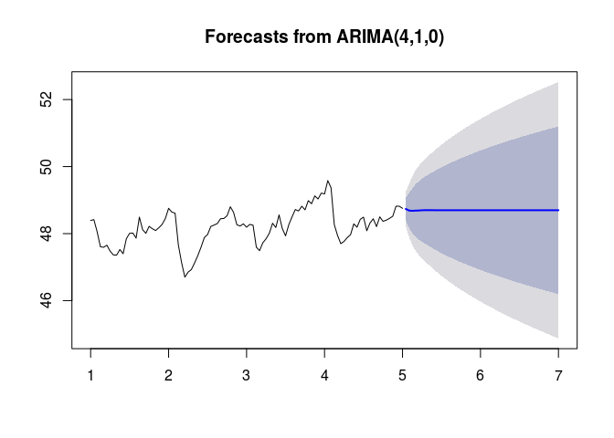

Goodness-of-fit
---------------

### Raw dataset

``` r
gof_raw_df = rbind(accuracy_SES_raw, accuracy_Holt_raw, accuracy_Holt_damp_raw, accuracy_HW_raw, accuracy_HW_mult_raw, accuracy_Holt_mult_damp_raw)
rownames(gof_raw_df) = c("SES", "Holt", "Holt + damped", "Holt-Winters", "Holt-Winters + mult. seasonal", "Holt-Winters + mult. seasonal + damped")
kable(gof_raw_df)
```

|                                        |         ME|      RMSE|        MAE|       MPE|      MAPE|
|----------------------------------------|----------:|---------:|----------:|---------:|---------:|
| SES                                    |  0.7414785|  1.104605|  0.8938294|  1.497108|  1.819187|
| Holt                                   |  1.8320472|  2.221092|  1.8875296|  3.730039|  3.847686|
| Holt + damped                          |  0.7419455|  1.104949|  0.8941403|  1.498068|  1.819818|
| Holt-Winters                           |  0.7064875|  1.076526|  0.8535160|  1.427714|  1.737241|
| Holt-Winters + mult. seasonal          |  0.8416915|  1.197109|  0.9488094|  1.704520|  1.930435|
| Holt-Winters + mult. seasonal + damped |  0.7273258|  1.093973|  0.8673312|  1.470362|  1.765198|

### Hourly-averaged dataset

``` r
gof_hr_df = rbind(accuracy_SES_hr, accuracy_Holt_hr, accuracy_Holt_damp_hr, accuracy_HW_hr, accuracy_HW_mult_hr, accuracy_Holt_mult_damp_hr, accuracy_ARIMA_hr, accuracy_ARIMA_hr_hand)
rownames(gof_hr_df) = c("SES", "Holt", "Holt + damped", "Holt-Winters", "Holt-Winters + mult. seasonal", "Holt-Winters + mult. seasonal + damped", "ARIMA", "ARIMA (by hand)")
kable(gof_hr_df)
```

|                                        |          ME|       RMSE|        MAE|         MPE|       MAPE|
|----------------------------------------|-----------:|----------:|----------:|-----------:|----------:|
| SES                                    |  -0.2204053|  0.5864959|  0.4899944|  -0.4666922|  1.0130557|
| Holt                                   |  -0.3616926|  0.6130314|  0.5131797|  -0.7566423|  1.0632480|
| Holt + damped                          |  -0.2699440|  0.6042476|  0.5048347|  -0.5687059|  1.0445034|
| Holt-Winters                           |  -0.0311528|  0.2447211|  0.1970181|  -0.0666454|  0.4052544|
| Holt-Winters + mult. seasonal          |  -0.1168085|  0.2856847|  0.2391721|  -0.2443477|  0.4928942|
| Holt-Winters + mult. seasonal + damped |   0.1665192|  0.3522158|  0.2755663|   0.3386209|  0.5642828|
| ARIMA                                  |  -0.2203991|  0.5864936|  0.4899924|  -0.4666794|  1.0130513|
| ARIMA (by hand)                        |  -0.1628769|  0.5663971|  0.4740962|  -0.3481205|  0.9792288|

In both the datasets, we see Holt-Winters is the best-fit model.

Cross-validation
----------------

For modeling techniques producing reasonably good results, let us perform one-step cross validation. We consider the first 3 days of data as training, and predict the next 12 hrs. of data by cross-validating over incremental time-series in multiple iterations.

``` r
n = length(timestamp_hr)
k = round(n*training_Set_size)
cross_len = 12
mae1 <- mae2 <- mae3 <- mae4 <- mae5 <- matrix(NA, n-k-cross_len, cross_len)
for (i in 0:(n-k-cross_len-1)) {
  #cat(sprintf("i=%d\n", i));
  usage_hr_crosstrain <- usage_hr[1:(k+i)]
  usage_hr_crosstest <- usage_hr[(k+i+1):(k+i+cross_len)]
  usage_hr_crosstrain_ts <- ts(usage_hr_crosstrain, frequency = 24)
  
  hw_fit <- hw(usage_hr_crosstrain_ts, h = cross_len)
  hw_mult_fit <- hw(usage_hr_crosstrain_ts, seasonal = "mult", h = cross_len)
  fit_arima <- auto.arima(usage_hr_crosstrain_ts, max.P = 0, max.Q = 0, D = 0)
  fit_arima_forecast <- forecast(fit_arima, h =cross_len)
  holt_fit <- holt(usage_hr_crosstrain_ts, h = cross_len)
  
  mae1[i+1,] <- abs(hw_fit$mean - usage_hr_crosstest)
  mae2[i+1,] <- abs(hw_mult_fit$mean - usage_hr_crosstest)
  mae3[i+1,] <- abs(fit_arima_forecast$mean - usage_hr_crosstest)
  mae4[i+1,] <- abs(holt_fit$mean - usage_hr_crosstest)
}

plot(1:cross_len,colMeans(mae1),ylim=c(0.15,0.75), type="o",col=1,xlab="Lag (hour)",ylab="MAE", main="", pch=0)
lines(1:cross_len,colMeans(mae2),type="o",col=1, pch=1)
lines(1:cross_len,colMeans(mae3),type="o",col=1, pch=2)
lines(1:cross_len,colMeans(mae4),type="o",col=1, pch=4)
legend("topleft",legend=c("Holt-Winters", "Holt-Winters (Mult.)", "ARIMA (auto)", "Holt"),pch=c(0,1,2,4),lty=1)
title(main="One-step forecasts using Cross Validation",  cex.main=1)
```

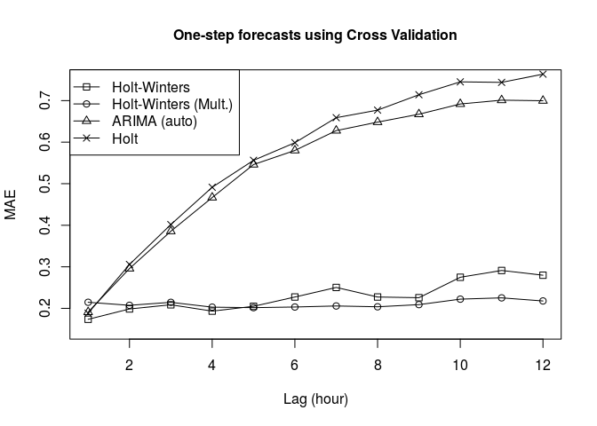

References
==========

Cotroneo, Domenico, Roberto Natella, Roberto Pietrantuono, and Stefano Russo. 2014. “A Survey of Software Aging and Rejuvenation Studies.” *ACM JETC* 10 (1). New York, NY, USA: ACM: 8:1–8:34.

Grottke, M., R. Matias, and K.S. Trivedi. 2008. “The Fundamentals of Software Aging.” In *IEEE WoSAR*, 1–6.

Hyndman, Rob J, and George Athanasopoulos. 2013. *Forecasting: Principles and Practice*. OTexts.

Hyndman, Rob J., and Anne B. Koehler. 2006. “Another Look at Measures of Forecast Accuracy.” *Int. Journal of Forecasting* 22 (4): 679–88.

Kendall, M. G. 1970. *Rank Correlation Methods*. 4th ed. Griffin, London.

Sen, Pranab Kumar. 1968. “Estimates of the Regression Coefficient Based on Kendall’s Tau.” *Journal of the American Statistical Association* 63 (324). Taylor & Francis, Ltd.: 1379–89.

Sukhwani, Harish, Rivalino Matias, Kishor S. Trivedi, and Andy Rindos. 2017. “Monitoring and Mitigating Software Aging on IBM Cloud Controller System.” In *IEEE International Workshop on Software Aging and Rejuvenation (WoSAR)*, 266–72. Toulouse, France.
